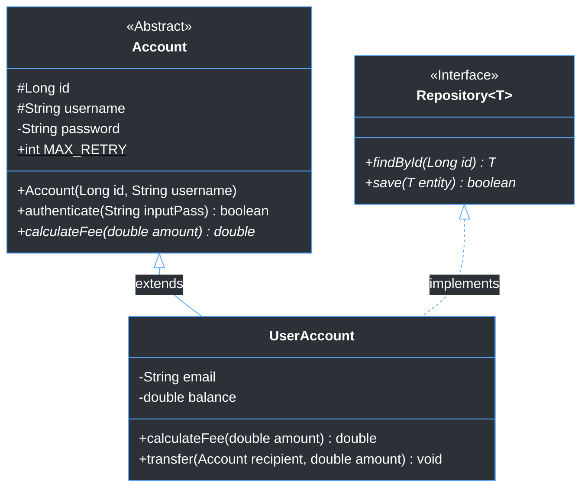

## Bài tập về nhà UET
- Lập trình hệ thống (C).
- Lập trình nâng cao (Java).

## Test mermaid

```mermaid
%%{init: {
  'theme': 'base',
  'themeVariables': {
    'primaryColor': '#2b3137',
    'primaryTextColor': '#ffffff',
    'primaryBorderColor': '#58a6ff',
    'lineColor': '#58a6ff',
    'secondaryColor': '#1f2428',
    'tertiaryColor': '#161b22'
  }
}}%%


classDiagram
    direction TB

    %% Định nghĩa Interface
    class Repository~T~ {
        <<Interface>>
        +findById(Long id) T*
        +save(T entity) boolean*
    }

    %% Định nghĩa Abstract Class
    class Account {
        <<Abstract>>
        #Long id
        #String username
        -String password
        +int MAX_RETRY$
        
        +Account(Long id, String username)
        +authenticate(String inputPass) boolean
        +calculateFee(double amount) double*
    }

    %% Định nghĩa Class kế thừa
    class UserAccount {
        -String email
        -double balance
        +calculateFee(double amount) double
        +transfer(Account recipient, double amount) void
    }

    %% Quan hệ giữa các class
    Account <|-- UserAccount : extends
    Repository <|.. UserAccount : implements
```
